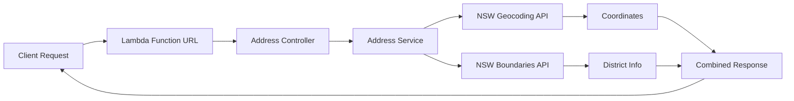

# NSW Address Lookup Lambda

Serverless function for NSW address lookup using government spatial APIs. Returns coordinates, suburb, and electoral district information.

Test it out [20 martin place](https://tehc5tz6eri6y7vnye7hym7u6a0vrgcp.lambda-url.ap-southeast-2.on.aws/?q=1%20MARTIN%20PLACE%20SYDNEY)


## Requirements
1. Node 22

## Quick Start

```bash
# Install and test locally
npm install && cd handlers
npm run dev "q=346 PANORAMA AVENUE BATHURST"
```

## API Usage

**Request:** `GET /?q=346 PANORAMA AVENUE BATHURST`

**Response:**
```json
{
  "success": true,
  "data": {
    "location": { "latitude": -33.429, "longitude": 149.567 },
    "address": "346 PANORAMA AVENUE BATHURST",
    "suburbName": "BATHURST",
    "stateElectoralDistrict": "BATHURST",
  }
}
```

## Architecture



## Local Development

```bash
# Valid address test
npm run dev "q=1 MARTIN PLACE SYDNEY"

# Error handling test  
npm run dev "q=INVALID ADDRESS"

# Run tests
npm run test
```

## Deployment

```bash
cd infrastructure
npm run build && npm run deploy
```