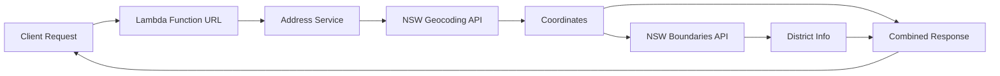

# NSW Address Lookup Lambda

Serverless function for NSW address lookup using government spatial APIs. Returns coordinates, suburb, and electoral district information.

Test it out [20 martin place](https://tehc5tz6eri6y7vnye7hym7u6a0vrgcp.lambda-url.ap-southeast-2.on.aws/?q=1%20MARTIN%20PLACE%20SYDNEY)

## Requirements

1. Node 22

## Quick Start

```bash
# Install and test locally
npm install && cd handlers
npm run dev
```
Then head to: 
http://localhost:3000?q=346%20PANORAMA%20AVENUE%20BATHURST

## API Usage

**Request:** `GET https://tehc5tz6eri6y7vnye7hym7u6a0vrgcp.lambda-url.ap-southeast-2.on.aws?q=346 PANORAMA AVENUE BATHURST`

**Response:**

```json
{
  "latitude": -33.429,
  "longitude": 149.567,
  "address": "346 PANORAMA AVENUE BATHURST",
  "suburbName": "BATHURST",
  "stateElectoralDistrict": "BATHURST",
  "propertyId": "123",
  "query": "346 PANORAMA AVENUE BATHURST"
}
```

## Architecture



## Local Development

```bash
npm run dev
# Valid address test
# http://localhost:3000/?q=1%20MARTIN%20PLACE%20SYDNEY

# Error handling test
# http://localhost:3000?q=INVALID%20ADDRESS

# Run tests
npm run test
```

## Deployment

Ensure you have logged into aws. Populate ACCOUNT_ID in your environment.

```bash
cd infrastructure
npm run build && npm run deploy
```
