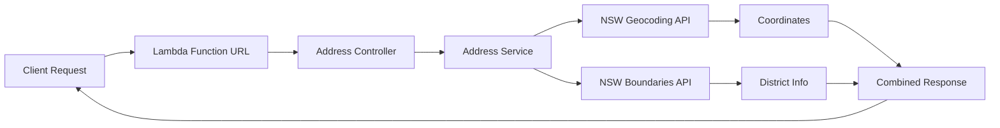

# NSW Address Lookup Lambda

Serverless function for NSW address lookup using government spatial APIs. Returns coordinates, suburb, and electoral district information.

## Quick Start

```bash
# Install and test locally
yarn install && cd handlers
yarn dev "q=346 PANORAMA AVENUE BATHURST"
```

## API Usage

**Request:** `GET /?q=346 PANORAMA AVENUE BATHURST`

**Response:**
```json
{
  "success": true,
  "data": {
    "location": { "latitude": -33.429, "longitude": 149.567 },
    "address": "346 PANORAMA AVENUE BATHURST",
    "suburbName": "BATHURST",
    "stateElectoralDistrict": "BATHURST",
    "propertyId": 3973380
  }
}
```

## Architecture



## Local Development

```bash
# Valid address test
yarn dev "q=1 MARTIN PLACE SYDNEY"

# Error handling test  
yarn dev "q=INVALID ADDRESS"

# Run tests
yarn test
```

## Deployment

```bash
cd infrastructure
yarn build && npx cdk deploy
```
